---
## Front matter
title: "Лабораторная работа № 1"
subtitle: "Дисциплина: Информационная безопасность"
author: "Новосельцев Данила Сергеевич"

## Generic otions
lang: ru-RU
toc-title: "Содержание"

## Bibliography
bibliography: bib/cite.bib
csl: pandoc/csl/gost-r-7-0-5-2008-numeric.csl

## Pdf output format
toc: true # Table of contents
toc-depth: 2
lof: true # List of figures
lot: false
fontsize: 12pt
linestretch: 1.5
papersize: a4
documentclass: scrreprt
## I18n polyglossia
polyglossia-lang:
  name: russian
  options:
	- spelling=modern
	- babelshorthands=true
polyglossia-otherlangs:
  name: english
## I18n babel
babel-lang: russian
babel-otherlangs: english
## Fonts
mainfont: PT Serif
romanfont: PT Serif
sansfont: PT Sans
monofont: PT Mono
mainfontoptions: Ligatures=TeX
romanfontoptions: Ligatures=TeX
sansfontoptions: Ligatures=TeX,Scale=MatchLowercase
monofontoptions: Scale=MatchLowercase,Scale=0.9
## Biblatex
biblatex: true
biblio-style: "gost-numeric"
biblatexoptions:
  - parentracker=true
  - backend=biber
  - hyperref=auto
  - language=auto
  - autolang=other*
  - citestyle=gost-numeric
## Pandoc-crossref LaTeX customization
figureTitle: "Рис."
tableTitle: "Таблица"
listingTitle: "Листинг"
lofTitle: "Список иллюстраций"
lotTitle: "Список таблиц"
lolTitle: "Листинги"
## Misc options
indent: true
header-includes:
  - \usepackage{indentfirst}
  - \usepackage{float} # keep figures where there are in the text
  - \floatplacement{figure}{H} # keep figures where there are in the text
---

# Цель работы

Получение практических навыков работы в консоли с атрибутами файлов, закрепление теоретических основ дискреционного разграничения доступа в современных системах с открытым кодом на базе ОС Linux.

# Выполнение лабораторной работы

1. Задал имя виритуальной машины и указал место, куда она сохранится(@fig:001).

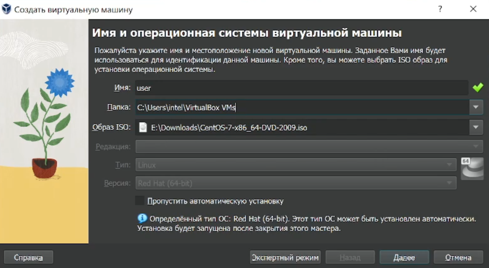{#fig:001}

2. Задал имя пользователя и его пароль(@fig:002).

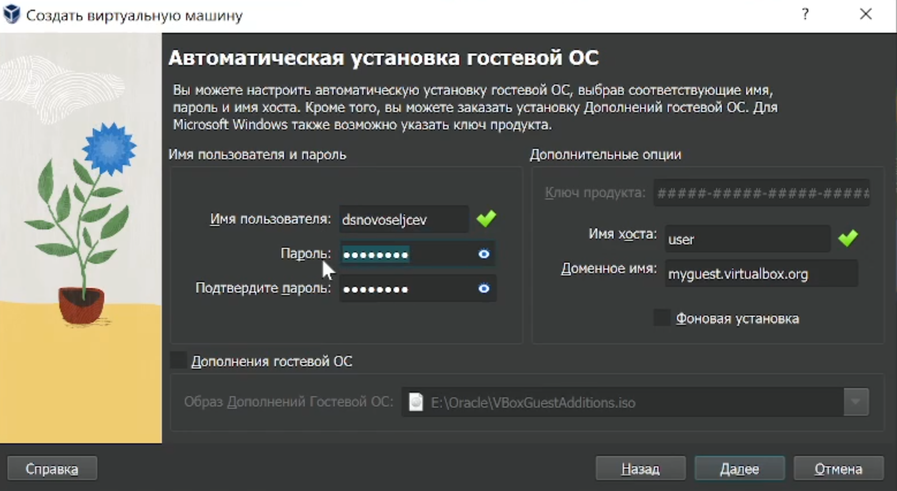{#fig:002}

3. Выделил память для виртуальной машины(@fig:003).

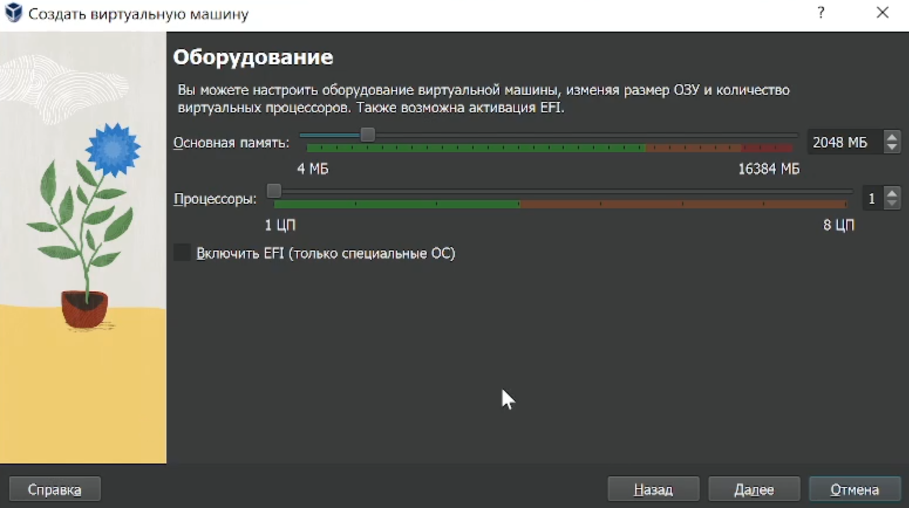{#fig:003}

4. Создал новый виртуальный жёсткий диск(@fig:004).

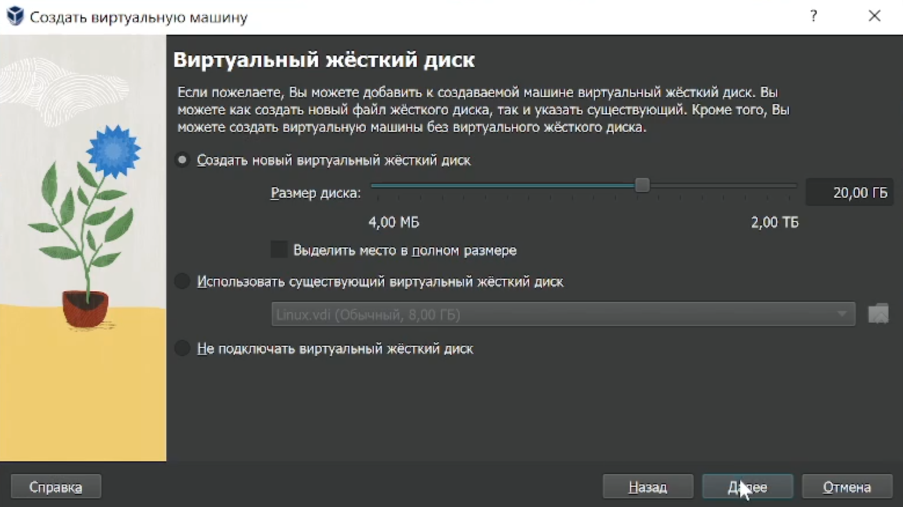{#fig:004}

5. После запуска установщика указал язык установки ОС(@fig:005).

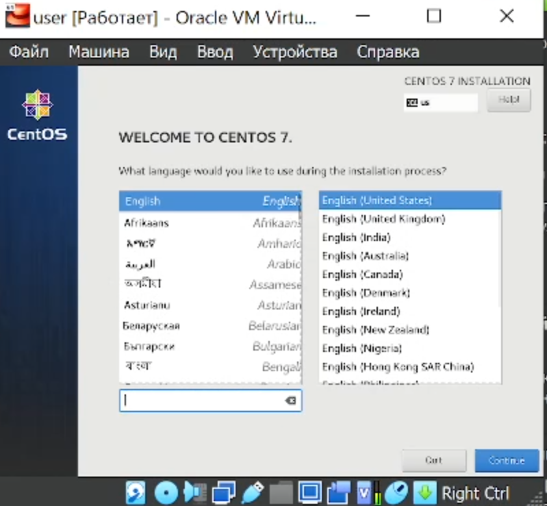{#fig:005}

6. Настроил раскладку клавиатуры(@fig:006).

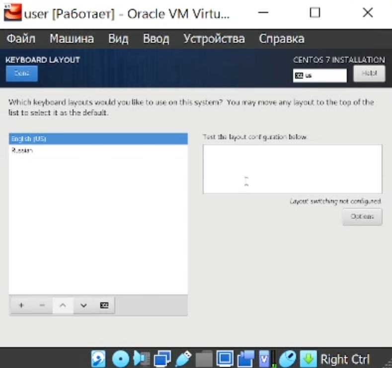{#fig:006}

7. Выбрал виртуальный жёсткий диск в качестве хранилища(@fig:007).

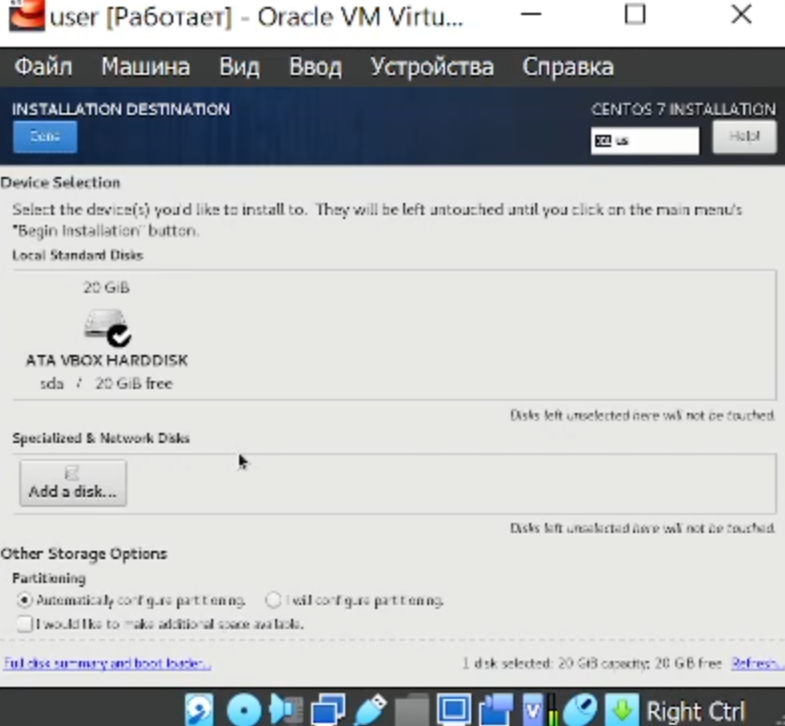{#fig:007}

8. Выбрал нужную программу(@fig:008).

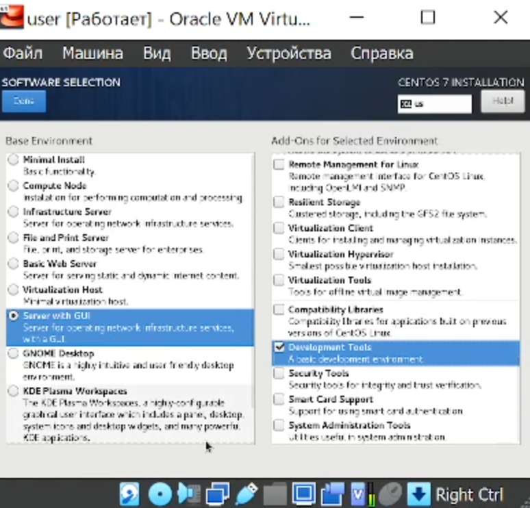{#fig:008}

9. Задал имя хоста и подключился к сети(@fig:009).

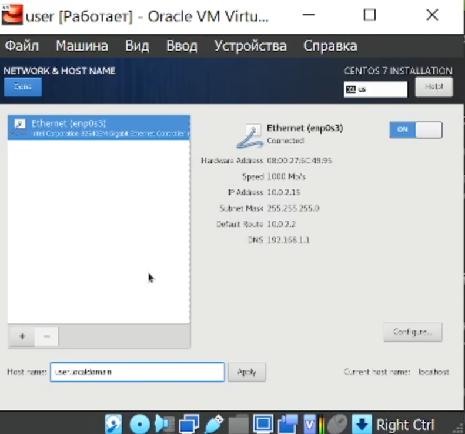{#fig:009}

10. Выключил kdump(@fig:010).

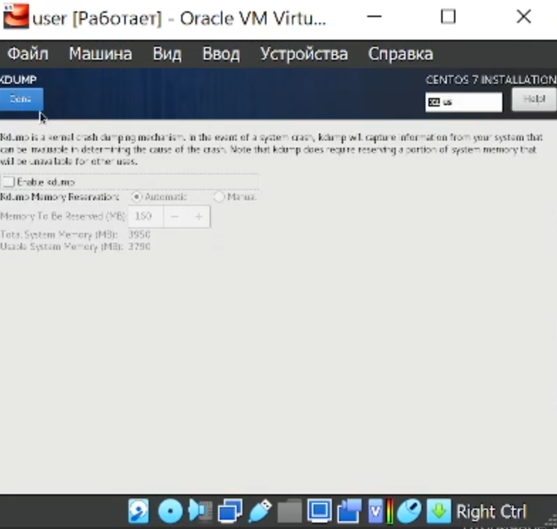{#fig:010}

11. Задал пароль корневому пользователю(@fig:011).

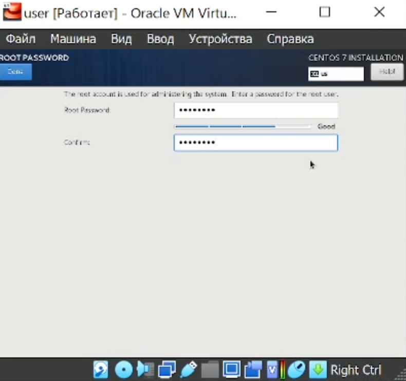{#fig:011}

12. Создал администратора и задал ему пароль(@fig:012).

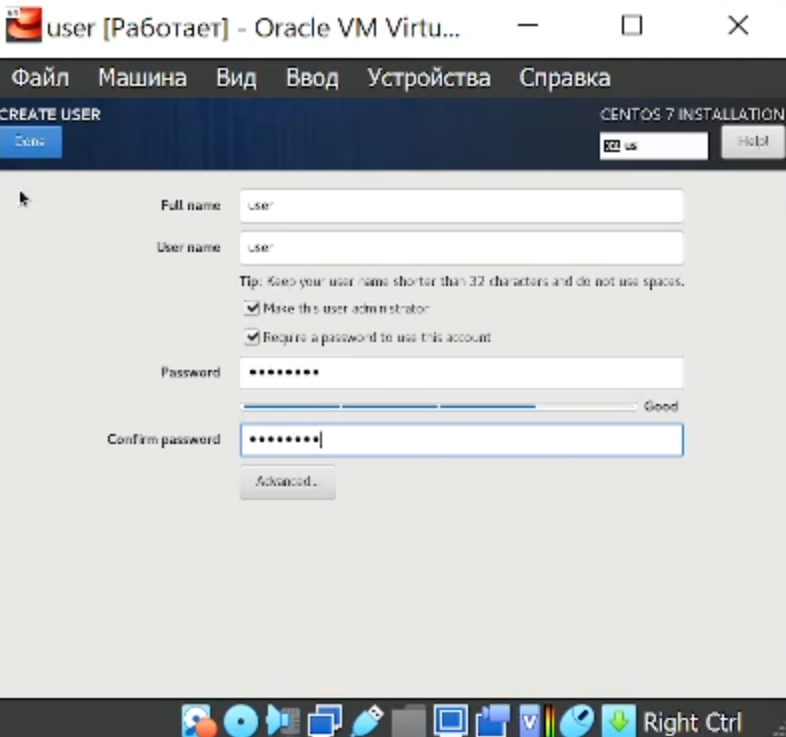{#fig:012 width=80%}

13. Принял лицензионное соглашение(@fig:013).

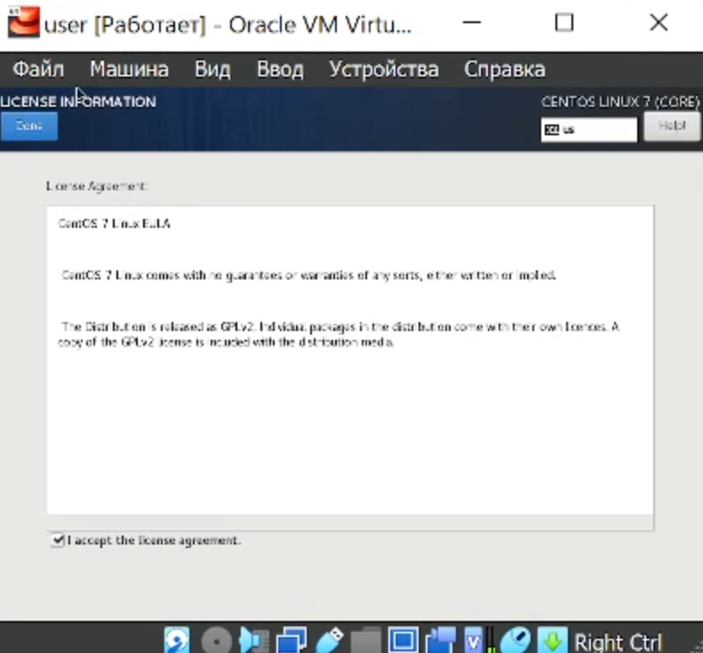{#fig:013}

14. 
C помощью команды dmesg | grep получил следующую информацию:
  1. Версия ядра Linux (Linux version).
  2. Частота процессора (Detected Mhz processor).
  3. Модель процессора (CPU0).
  4. Объем доступной оперативной памяти (Memory available).
  5. Тип обнаруженного гипервизора (Hypervisor detected).
  6. Тип файловой системы корневого раздела.(@fig:014).

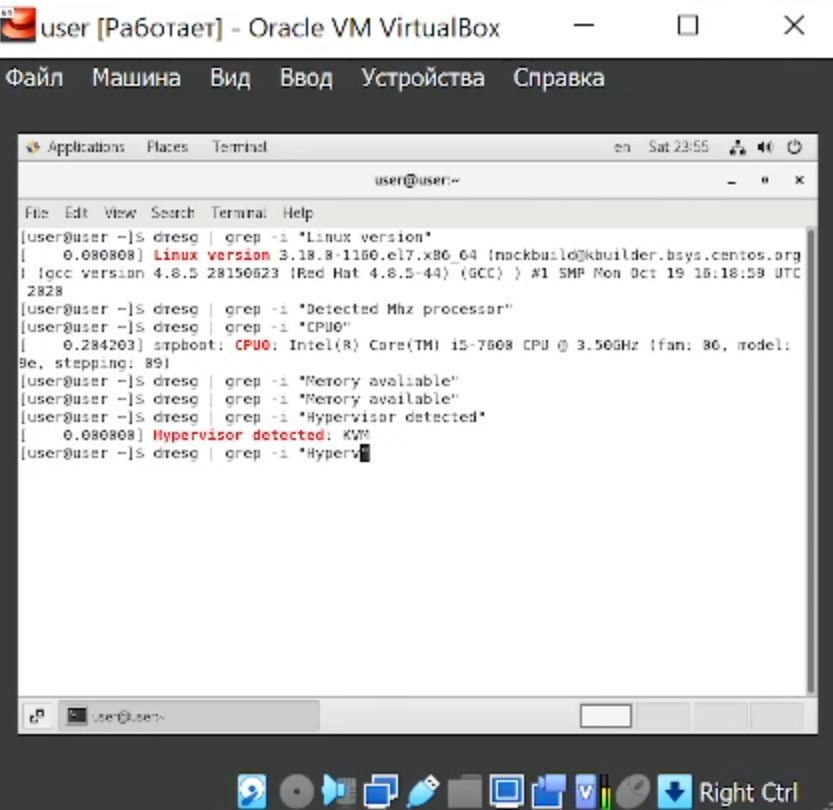{#fig:014}

# Выводы

Получил практические навыки работы в консоли с атрибутами файлов, закрепил теоретические основы дискреционного разграничения доступа в современных системах с открытым кодом на базе ОС Linux.