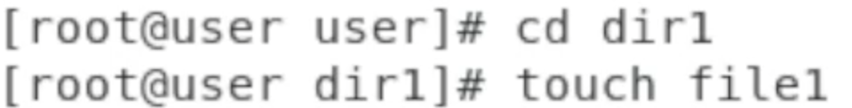
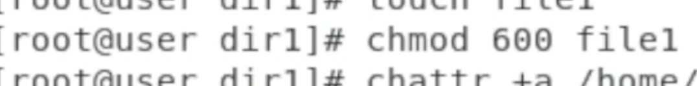
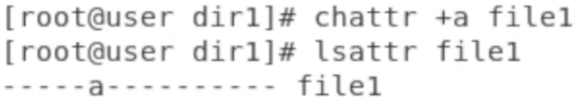
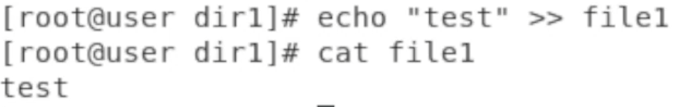
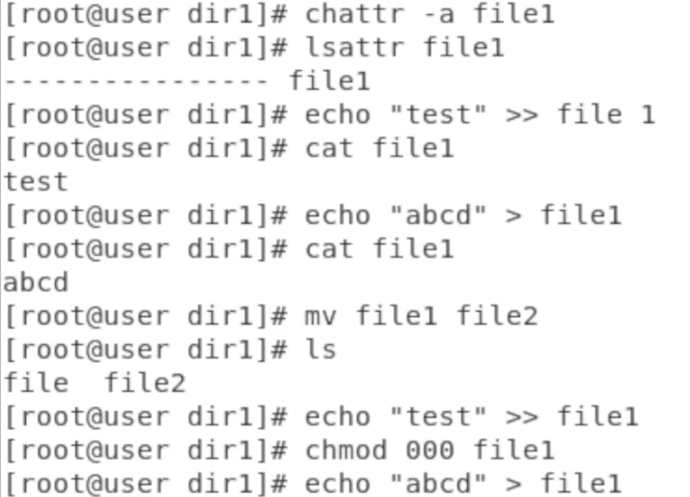
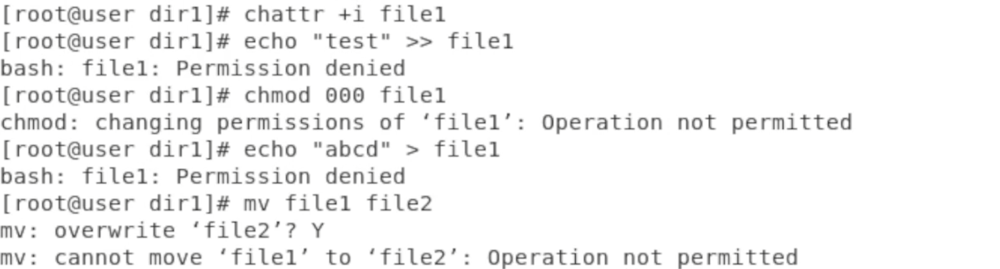

---
## Front matter
lang: ru-RU
title: Лабораторная работа № 4
author:
  - Новосельцев Данила Сергеевич
group:
  - НФИбд-02-20, 1032206559
date: 2023, Москва

## i18n babel
babel-lang: russian
babel-otherlangs: english

## Formatting pdf
toc: false
toc-title: Содержание
slide_level: 2
aspectratio: 169
section-titles: true
theme: metropolis
header-includes:
 - \metroset{progressbar=frametitle,sectionpage=progressbar,numbering=fraction}
 - '\makeatletter'
 - '\beamer@ignorenonframefalse'
 - '\makeatother'
---

## Цель работы

Получение практических навыков работы в консоли с расширенными атрибутами файлов.

## Ход работы

{#fig:001 width=45%}

## Ход работы

{#fig:002 width=45%}

## Ход работы

{#fig:003 width=45%}

## Ход работы

{#fig:004 width=45%}

## Ход работы

{#fig:005 width=45%}

## Ход работы

{#fig:006 width=45%}

## Выводы

Получил практические навыки работы в консоли с расширенными атрибутами файлов.