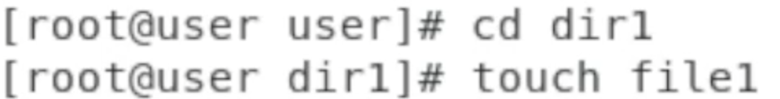
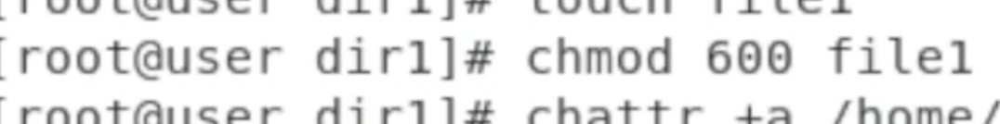
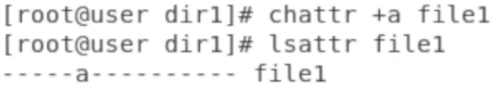
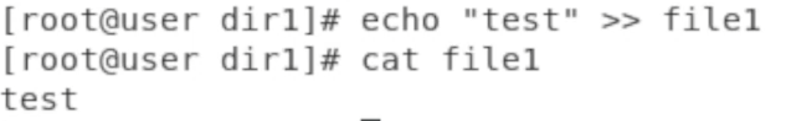
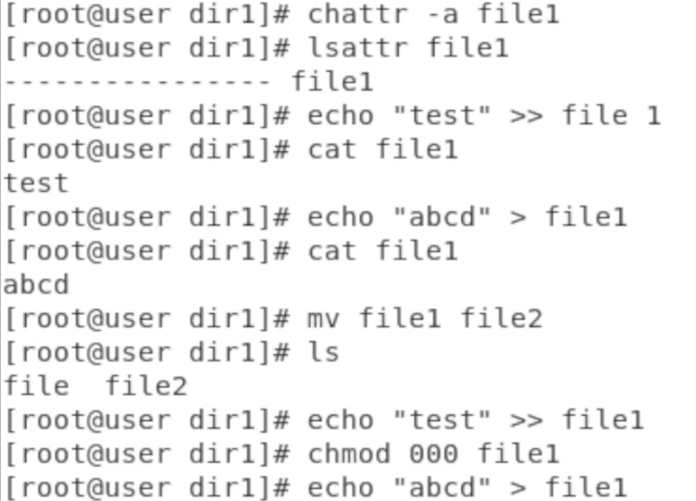
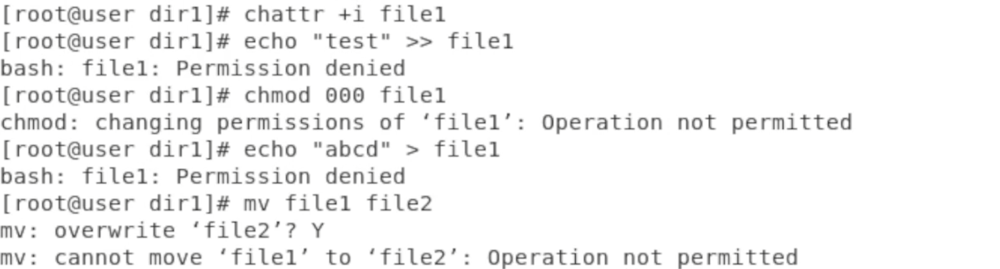

---
## Front matter
title: "Лабораторная работа № 4"
subtitle: "Дисциплина: Информационная безопасность"
author: "Новосельцев Данила Сергеевич"

## Generic otions
lang: ru-RU
toc-title: "Содержание"

## Bibliography
bibliography: bib/cite.bib
csl: pandoc/csl/gost-r-7-0-5-2008-numeric.csl

## Pdf output format
toc: true # Table of contents
toc-depth: 2
lof: true # List of figures
lot: false
fontsize: 12pt
linestretch: 1.5
papersize: a4
documentclass: scrreprt
## I18n polyglossia
polyglossia-lang:
  name: russian
  options:
	- spelling=modern
	- babelshorthands=true
polyglossia-otherlangs:
  name: english
## I18n babel
babel-lang: russian
babel-otherlangs: english
## Fonts
mainfont: PT Serif
romanfont: PT Serif
sansfont: PT Sans
monofont: PT Mono
mainfontoptions: Ligatures=TeX
romanfontoptions: Ligatures=TeX
sansfontoptions: Ligatures=TeX,Scale=MatchLowercase
monofontoptions: Scale=MatchLowercase,Scale=0.9
## Biblatex
biblatex: true
biblio-style: "gost-numeric"
biblatexoptions:
  - parentracker=true
  - backend=biber
  - hyperref=auto
  - language=auto
  - autolang=other*
  - citestyle=gost-numeric
## Pandoc-crossref LaTeX customization
figureTitle: "Рис."
tableTitle: "Таблица"
listingTitle: "Листинг"
lofTitle: "Список иллюстраций"
lotTitle: "Список таблиц"
lolTitle: "Листинги"
## Misc options
indent: true
header-includes:
  - \usepackage{indentfirst}
  - \usepackage{float} # keep figures where there are in the text
  - \floatplacement{figure}{H} # keep figures where there are in the text
---

# Цель работы

Получение практических навыков работы в консоли с расширенными атрибутами файлов.

# Порядок выполнения работы

1. Создал file1 (@fig:001).

{#fig:001}

2. Установил командой
chmod 600 file1
на файл file1 права, разрешающие чтение и запись для владельца файла(@fig:002).

{#fig:002}

3. Попробовал установить на файл /home/guest/dir1/file1 расширенный атрибут a от имени пользователя guest:
chattr +a /home/guest/dir1/file1
В ответ получил отказ от выполнения операции.

4. Повысил свои права с помощью команды su. Попробовал установить расширенный атрибут a на файл /home/guest/dir1/file1 от имени суперпользователя, проверил правильность установления атрибута(@fig:003).

{#fig:003}

5. Выполнил дозапись в файл file1 слова «test» командой
echo "test" /home/guest/dir1/file1
После этого выполнил чтение файла file1 командой
cat /home/guest/dir1/file1
Убедился, что слово test было успешно записано в file1(@fig:004).

{#fig:004}

6. Попробовал стереть имеющуюся в file1 информацию командой
echo "abcd" > /home/guest/dirl/file1
Попровал переименовать файл.

7. Попробовал с помощью команды
chmod 000 file1 установить на файл file1 права, например, запрещающие чтение и запись для владельца файла.

8. Сниял расширенный атрибут a с файла /home/guest/dirl/file1 от имени суперпользователя командой
chattr -a /home/guest/dir1/file1
Повторил операции, которые ранее не удавалось выполнить(@fig:005).

{#fig:005}

9. Повторил действия по шагам, заменив атрибут «a» атрибутом «i»(@fig:006).

{#fig:006}

# Выводы

Получил практические навыки работы в консоли с расширенными атрибутами файлов.

# Список литературы{.unnumbered}

[1] https://esystem.rudn.ru/pluginfile.php/2090277/mod_resource/content/3/004-lab_discret_extattr.pdf