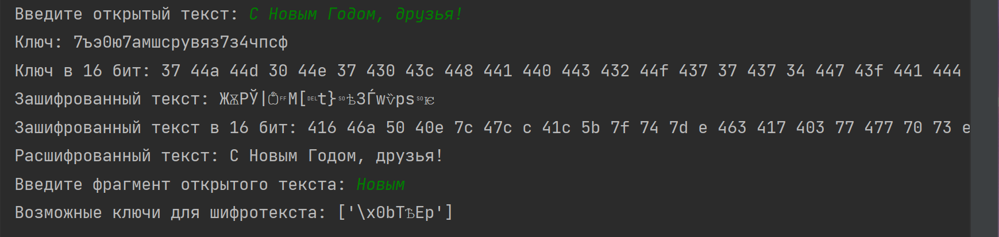

---
## Front matter
lang: ru-RU
title: Лабораторная работа № 7
author:
  - Новосельцев Данила Сергеевич
group:
  - НФИбд-02-20, 1032206559
date: 2023, Москва

## i18n babel
babel-lang: russian
babel-otherlangs: english

## Formatting pdf
toc: false
toc-title: Содержание
slide_level: 2
aspectratio: 169
section-titles: true
theme: metropolis
header-includes:
 - \metroset{progressbar=frametitle,sectionpage=progressbar,numbering=fraction}
 - '\makeatletter'
 - '\beamer@ignorenonframefalse'
 - '\makeatother'
---

## Цель работы

Освоить на практике применение режима однократного гаммирования на примере кодирования различных исходных текстов одним ключом.

## Код программы

```sh
import random
import string

class TextEncoding:
```
## Код программы
```sh
    @staticmethod
    def determine_alphabet(text):
        if text[0] in string.ascii_lowercase:
            return string.ascii_lowercase + string.digits
        else:
            return "абвгдеёжзийклмнопрстуфхцчшщъыьэюя" + string.digits
``` 
## Код программы
```sh
    @staticmethod
    def generate_key(size, alphabet):
        return "".join(random.choice(alphabet) for _ in range(size))

    @staticmethod
    def to_hex(coding):
        return " ".join(hex(ord(character))[2:] for character in coding)
```
## Код программы
```sh
    @staticmethod
    def encode_string(text, key):
        return "".join(chr(ord(char) ^ ord(key_char)) for char, key_char in zip(text, key))
``` 
## Код программы
```sh
    @staticmethod
    def find_possible_keys(text, fragment):
        key_length = len(fragment)
        possible_keys = []

        for index in range(len(text) - key_length + 1):
            key = [chr(ord(char) ^ ord(key_char)) for char, key_char in zip(text[index:index + key_length], fragment)]
            presumed_plaintext = TextEncoding.encode_string(text, key)

            if fragment in presumed_plaintext:
                possible_keys.append(''.join(key))

        return possible_keys

``` 
## Код программы
```sh
plaintext = input("Введите открытый текст: ")
alphabet = TextEncoding.determine_alphabet(plaintext)
key = TextEncoding.generate_key(len(plaintext), alphabet)

print(f"Ключ: {key}", f"Ключ в 16 бит: {TextEncoding.to_hex(key)}", sep='\n')
```
## Код программы
```sh
ciphertext = TextEncoding.encode_string(plaintext, key)
print(f"Зашифрованный текст: {ciphertext}", f"Зашифрованный текст в 16 бит: {TextEncoding.to_hex(ciphertext)}",
      sep='\n')
```
## Код программы
```sh
decrypted_text = TextEncoding.encode_string(ciphertext, key)
print("Расшифрованный текст:", decrypted_text)
```
## Код программы
```sh
known_fragment = input("Введите фрагмент открытого текста: ")
possible_keys = TextEncoding.find_possible_keys(ciphertext, known_fragment)
print("Возможные ключи для шифротекста:", possible_keys)
```
## Вывод программы
{#fig:001}

## Вывод

Освоил на практике применение режима однократного гаммирования на примере кодирования различных исходных текстов одним ключом.
