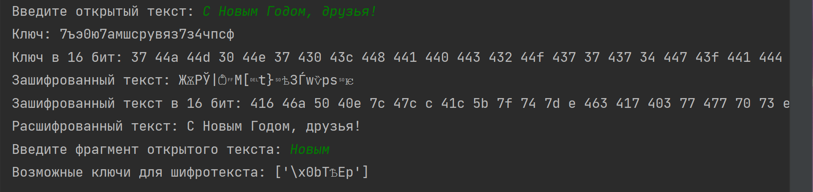

---
## Front matter
title: "Лабораторная работа № 3"
subtitle: "Дисциплина: Информационная безопасность"
author: "Новосельцев Данила Сергеевич"

## Generic otions
lang: ru-RU
toc-title: "Содержание"

## Bibliography
bibliography: bib/cite.bib
csl: pandoc/csl/gost-r-7-0-5-2008-numeric.csl

## Pdf output format
toc: true # Table of contents
toc-depth: 2
lof: true # List of figures
lot: false
fontsize: 12pt
linestretch: 1.5
papersize: a4
documentclass: scrreprt
## I18n polyglossia
polyglossia-lang:
  name: russian
  options:
	- spelling=modern
	- babelshorthands=true
polyglossia-otherlangs:
  name: english
## I18n babel
babel-lang: russian
babel-otherlangs: english
## Fonts
mainfont: PT Serif
romanfont: PT Serif
sansfont: PT Sans
monofont: PT Mono
mainfontoptions: Ligatures=TeX
romanfontoptions: Ligatures=TeX
sansfontoptions: Ligatures=TeX,Scale=MatchLowercase
monofontoptions: Scale=MatchLowercase,Scale=0.9
## Biblatex
biblatex: true
biblio-style: "gost-numeric"
biblatexoptions:
  - parentracker=true
  - backend=biber
  - hyperref=auto
  - language=auto
  - autolang=other*
  - citestyle=gost-numeric
## Pandoc-crossref LaTeX customization
figureTitle: "Рис."
tableTitle: "Таблица"
listingTitle: "Листинг"
lofTitle: "Список иллюстраций"
lotTitle: "Список таблиц"
lolTitle: "Листинги"
## Misc options
indent: true
header-includes:
  - \usepackage{indentfirst}
  - \usepackage{float} # keep figures where there are in the text
  - \floatplacement{figure}{H} # keep figures where there are in the text
---

# Цель работы

Освоение на практике применения режима однократного гаммирования.

# Код программы

```sh
import random
import string

class TextEncoding:

    @staticmethod
    def determine_alphabet(text):
        if text[0] in string.ascii_lowercase:
            return string.ascii_lowercase + string.digits
        else:
            return "абвгдеёжзийклмнопрстуфхцчшщъыьэюя" + string.digits

    @staticmethod
    def generate_key(size, alphabet):
        return "".join(random.choice(alphabet) for _ in range(size))

    @staticmethod
    def to_hex(coding):
        return " ".join(hex(ord(character))[2:] for character in coding)

    @staticmethod
    def encode_string(text, key):
        return "".join(chr(ord(char) ^ ord(key_char)) for char, key_char in zip(text, key))

    @staticmethod
    def find_possible_keys(text, fragment):
        key_length = len(fragment)
        possible_keys = []

        for index in range(len(text) - key_length + 1):
            key = [chr(ord(char) ^ ord(key_char)) for char, key_char in zip(text[index:index + key_length], fragment)]
            presumed_plaintext = TextEncoding.encode_string(text, key)

            if fragment in presumed_plaintext:
                possible_keys.append(''.join(key))

        return possible_keys


plaintext = input("Введите открытый текст: ")
alphabet = TextEncoding.determine_alphabet(plaintext)
key = TextEncoding.generate_key(len(plaintext), alphabet)

print(f"Ключ: {key}", f"Ключ в 16 бит: {TextEncoding.to_hex(key)}", sep='\n')

ciphertext = TextEncoding.encode_string(plaintext, key)
print(f"Зашифрованный текст: {ciphertext}", f"Зашифрованный текст в 16 бит: {TextEncoding.to_hex(ciphertext)}",
      sep='\n')

decrypted_text = TextEncoding.encode_string(ciphertext, key)
print("Расшифрованный текст:", decrypted_text)

known_fragment = input("Введите фрагмент открытого текста: ")
possible_keys = TextEncoding.find_possible_keys(ciphertext, known_fragment)
print("Возможные ключи для шифротекста:", possible_keys)
```

{#fig:001}

# Вывод

Освоил на практике применение режима однократного гаммирования.

# Список литературы

[1] https://esystem.rudn.ru/pluginfile.php/2090284/mod_resource/content/2/007-
lab_crypto-gamma.pdf