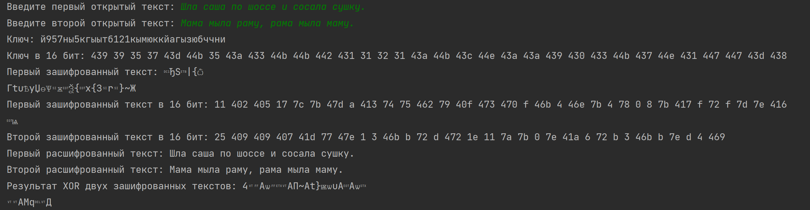

---
## Front matter
lang: ru-RU
title: Лабораторная работа № 7
author:
  - Новосельцев Данила Сергеевич
group:
  - НФИбд-02-20, 1032206559
date: 2023, Москва

## i18n babel
babel-lang: russian
babel-otherlangs: english

## Formatting pdf
toc: false
toc-title: Содержание
slide_level: 2
aspectratio: 169
section-titles: true
theme: metropolis
header-includes:
 - \metroset{progressbar=frametitle,sectionpage=progressbar,numbering=fraction}
 - '\makeatletter'
 - '\beamer@ignorenonframefalse'
 - '\makeatother'
---

## Цель работы

Освоить на практике применение режима однократного гаммирования на примере кодирования различных исходных текстов одним ключом.

## Код программы

```sh
import random
import string

class TextEncoding:
```

## Код программы

```sh
    @staticmethod
    def determine_alphabet(text):
        if text[0] in string.ascii_lowercase:
            return string.ascii_lowercase + string.digits
        else:
            return "абвгдеёжзийклмнопрстуфхцчшщъыьэюя" + string.digits
```

## Код программы

```sh
    @staticmethod
    def generate_key(size, alphabet):
        return "".join(random.choice(alphabet) for _ in range(size))

    @staticmethod
    def to_hex(coding):
        return " ".join(hex(ord(character))[2:] for character in coding)
```

## Код программы

```sh
    @staticmethod
    def encode_string(text, key):
        return "".join(chr(ord(char) ^ ord(key_char)) for char, key_char in zip(text, key))
```

## Код программы

```sh
    @staticmethod
    def xor_texts(ciphertext1, ciphertext2):
        return "".join(chr(ord(char1) ^ ord(char2)) for char1, char2 in zip(ciphertext1, ciphertext2))

```

## Код программы

```sh
plaintext1 = input("Введите первый открытый текст: ")
plaintext2 = input("Введите второй открытый текст: ")
alphabet = TextEncoding.determine_alphabet(plaintext1)
key = TextEncoding.generate_key(len(plaintext1), alphabet)

print(f"Ключ: {key}", f"Ключ в 16 бит: {TextEncoding.to_hex(key)}", sep='\n')
```

## Код программы

```sh
ciphertext1 = TextEncoding.encode_string(plaintext1, key)
ciphertext2 = TextEncoding.encode_string(plaintext2, key)
print(f"Первый зашифрованный текст: {ciphertext1}", f"Первый зашифрованный текст в 16 бит: {TextEncoding.to_hex(ciphertext1)}",
      sep='\n')
print(f"Второй зашифрованный текст: {ciphertext2}", f"Второй зашифрованный текст в 16 бит: {TextEncoding.to_hex(ciphertext2)}",
      sep='\n')
```

## Код программы

```sh
decrypted_text1 = TextEncoding.encode_string(ciphertext1, key)
decrypted_text2 = TextEncoding.encode_string(ciphertext2, key)
print("Первый расшифрованный текст:", decrypted_text1)
print("Второй расшифрованный текст:", decrypted_text2)
```

## Код программы

```sh
xor_result = TextEncoding.xor_texts(ciphertext1, ciphertext2)
print("Результат XOR двух зашифрованных текстов:", xor_result)
```
## Вывод программы

{#fig:001}


## Вывод

Освоил на практике применение режима однократного гаммирования на примере кодирования различных исходных текстов одним ключом.